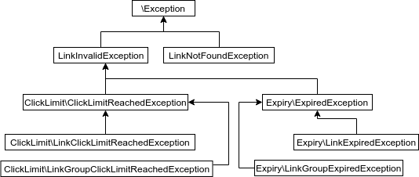

# Laravel Signed URLs

> Enhanced signed URLs for Laravel, including attaching data, click limits and expiry.

<!-- PROJECT SHIELDS -->

[](https://scrutinizer-ci.com/g/linkeys-app/signed-url/build-status/master)
[](https://scrutinizer-ci.com/g/linkeys-app/signed-url/?branch=master)
[](https://scrutinizer-ci.com/g/linkeys-app/signed-url/?branch=master)
[](https://packagist.org/packages/linkeys/signed-url)
[](https://packagist.org/packages/linkeys/signed-url)

## Table of Contents

* [Introduction](#introduction)
* [Version Compatibility](#version-compatibility)
* [Getting Started](#getting-started)
    * [Installation](#installation)
* [Usage](#usage)
    * [Overview](#overview)
    * [Creating a Link](#creating-a-link)
    * [Handling a Link](#handling-a-link)
* [Examples](#examples)
* [Licence](#license)
* [Contact](#contact)

## Introduction

Revamped URL signing brought to Laravel. Pass data through any url securely, and control expiry and number of clicks.

- Securely attach data to links to make it available to your controllers.
- Create links of a limited lifetime.
- Limit the number of clicks allowed on a link.
- Limit the number of clicks on a group of links, such as only allowing one of a group of links to be clicked.

## Version Compatibility


 Laravel  | Url Signer
:---------|:----------
 5.7.x    | 1.0.x
 5.8.x    | 1.0.x
 6.x      | 1.0.3|2.0.x
 7.x      | 2.0.x
 8.x      | 3.0.x

## Getting Started

It couldn't be easier to install and set up url signing in your laravel app.

### Installation

1. Install through the composer package manager

    ```
    composer require linkeys/signed-url
    ```

2. (Optional) Publish the assets

    ```
    php artisan vendor:publish --provider="Linkeys\UrlSigner\Providers\UrlSignerServiceProvider"
    ```
    You can also use the ```--tag=config``` or ```--tag=migrations``` flags to only publish the configuration files or the migrations.

3. Run the migrations

    ```php artisan migrate```

## Usage

### Overview

This package works by modifying a URL to give it a signature. This must be a url you have registered in
your routes. When the signed URL is opened in the browser, our middleware will not only inject the 
attached data into a controller request, but throw exceptions if the link has expired, been clicked 
too many times or altered in any way.

### Creating a Link

#### Standard Link
The easiest way to create a link is through the facade:

```php 
$link = \Linkeys\UrlSigner\Facade\UrlSigner::generate('https://www.example.com/invitation');
echo $link->getFullUrl(); // https://www.example.com/invitation?uuid=UUID
```

The link can now be sent out or used just like normal signed URLs. You may also use the sign method, 
which is simply an alias for generate, and the alias instead of importing the full facade namespace
```php
$link = UrlSigner::sign('https://www.example.com/invitation');
```

You can also resolve an instance of ```\Linkeys\UrlSigner\Contracts\UrlSigner``` from the container and call the facade functions directly.

#### Data 
Instead of encoding data into the url yourself, simply pass it as the second argument.

```php 
$link = \Linkeys\UrlSigner\Facade\UrlSigner::generate('https://www.example.com/invitation', ['foo' => 'bar']);
echo $link->getFullUrl(); // https://www.example.com/invitation?uuid=UUID
```
In your controller, e.g. InvitationController.php
```php
echo $request->get('foo');  // bar
```

Through this method, the data can't be altered by anyone and can't even be seen by users, securing your application and hiding implementation details.

#### Expiry

Additional to a basic link is the ability to set the expiry of the link. Only want a link to be available for 24 hours?


```php 
$link = \Linkeys\UrlSigner\Facade\UrlSigner::generate('https://www.example.com/invitation', ['foo' => 'bar'], '+24 hours');
```

The expiry accepts a string, unix timestamp or a datetime instance (i.e. Carbon).

#### Click Limit

The number of clicks of a link can also be set. If you only want a user to be able to click a link one time:

```php 
$link = \Linkeys\UrlSigner\Facade\UrlSigner::generate('https://www.example.com/invitation', ['foo' => 'bar'], '+24 hours', 1);
```

The first time the link is clicked, the route will work like normal. The second time, since the link only has a single click, an exception will be thrown.
Of course, passing ```null``` instead of ```'+24 hours'``` to the expiry parameter will create links of an indefinite lifetime.

#### Link Groups
By grouping links, the click limit may be spread across multiple links. Given a group with a click limit of 2 but 3 links will only allow two total clicks.
Expiry is default for links unless they specify it themselves.

```php
    $group = \Linkeys\UrlSigner\Facade\UrlSigner::group(function($links) {
        $links->generate('https://www.example.com', ['foo'=>'bar']),
        $links->generate('https://www.example.com', ['foo'=>'baz'])
    }, '+ 24 hours', 1)'
```

This will create two links, both with different data and expiring in 24 hours, but since the group click limit is 1 only a single link may be clicked.
This is useful for situations in which you want to give the user a choice of links to click, such as for an invitation (the user should only be able to click 'Yes' or 'No' to respond).

The expiry parameter in a group is a default applied to all links in the group which don't have an 
expiry date. If you set the expiry date in the link in addition to the in the group, only the link
expiry will be checked.

You can access the links using ```$group->links;```, which wll return a Laravel collection.

### Handling a Link
    
#### Middleware
    
To enable exceptions to be thrown when a link is invalid in any way, simply add the ```'link'```
middleware to any relevant routes. This will take care of:
- Ensuring the URL has not been changed.
- Checking the link has not expired.
- Checking the link hasn't reached the limit on number of clicks.
- Adding the link and relevant data into the request.
  
#### Retrieving Link Information

We automatically put all data attached to a link into the request attributes. The following is a controller
method called when a user clicks on a generated link with data attached.

```php
public function acceptInvitation(Request $request)
{
    // Given the link has the data ['foo' => 'bar']...
    $bar = $request->get('foo');
    
    // To retrieve the link instance:
    $link = $request->get(\Linkeys\UrlSigner\Models\Link::class);
    var_dump($link->data)  // ['foo' => 'bar']
}
```
    
#### Error handling

The middleware will throw exceptions when the link is invalid in any way. By default, these will be
handled by Laravel to display an error page with a simple message.
 
By using your apps exception handler, you can choose to show custom pages to respond to each of 
the following situations by catching an error and returning a response:

| Condition                                     | Exception                           |
|-----------------------------------------------|-------------------------------------|
| URL has been changed                          | LinkNotFoundException               |
| Signature was not found                       | LinkNotFoundException               |
| Link has been clicked too many times          | LinkClickLimitReachedException      |
| Link group has been clicked too many times    | LinkGroupClickLimitReachedException |
| Link has expired                              | LinkExpiredException                |
| Link group has expired and link had no expiry | LinkGroupExpiredException           |

Through using exception inheritance, you can control which pages to show for which exception, or just
have a single page for all link exceptions. The inheritance diagram is shown below, with all classes 
being in the namespace ```\Linkeys\UrlSigner\Exceptions``` except for ```\Exception```.



## Examples

Coming soon...

## Contributing

Contributions are what make the open source community such an amazing place to be learn, inspire, and create. Any contributions you make are **greatly appreciated**.
See `CONTRIBUTING.md` for more information.

1. Fork the Project

2. Create your Feature Branch (`git checkout -b feature/AmazingFeature`)

3. Commit your Changes (`git commit -m 'Add some AmazingFeature`)

4. Push to the Branch (`git push origin feature/AmazingFeature`)

5. Open a pull request

## License

Distributed under the MIT License. See `LICENSE` for more information.

## Contact

Toby Twigger - [toby@linkeys.app](mailto:toby@linkeys.app)

Project Link: [https://github.com/linkeys-app/signed-url](https://github.com/linkeys-app/signed-url)

